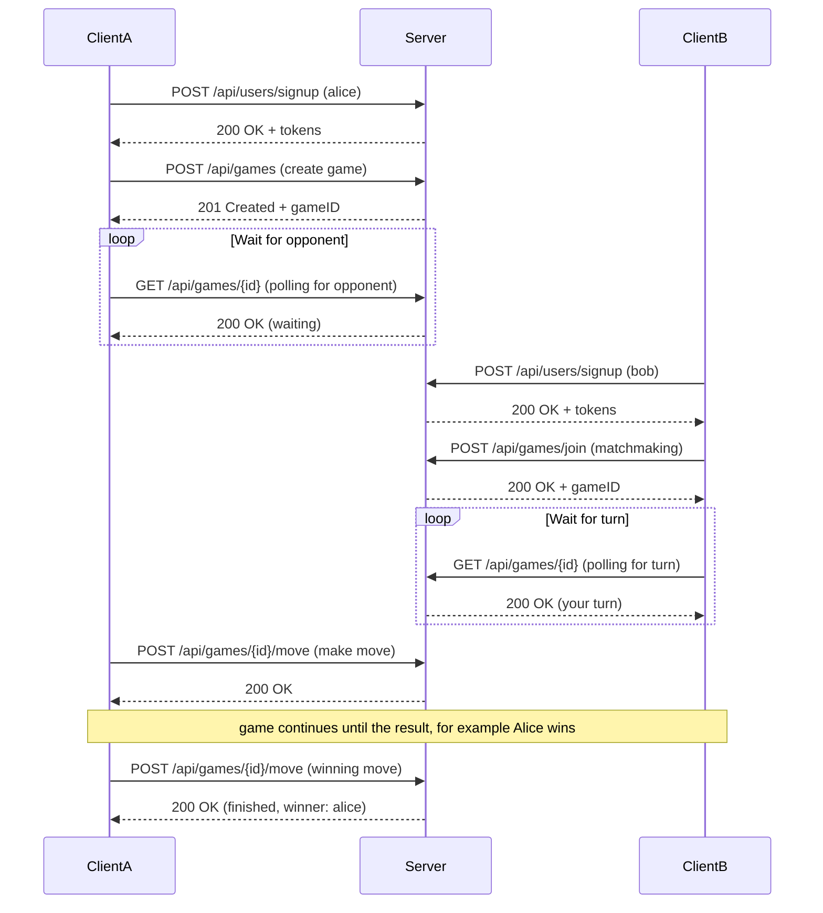
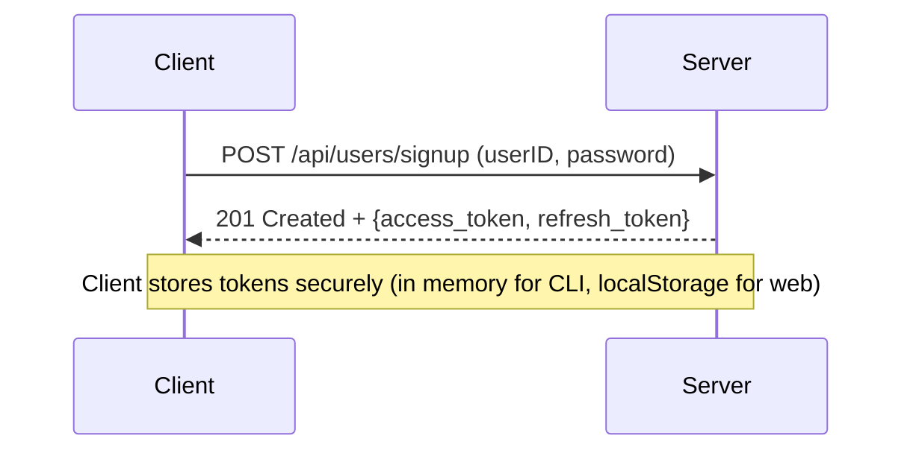
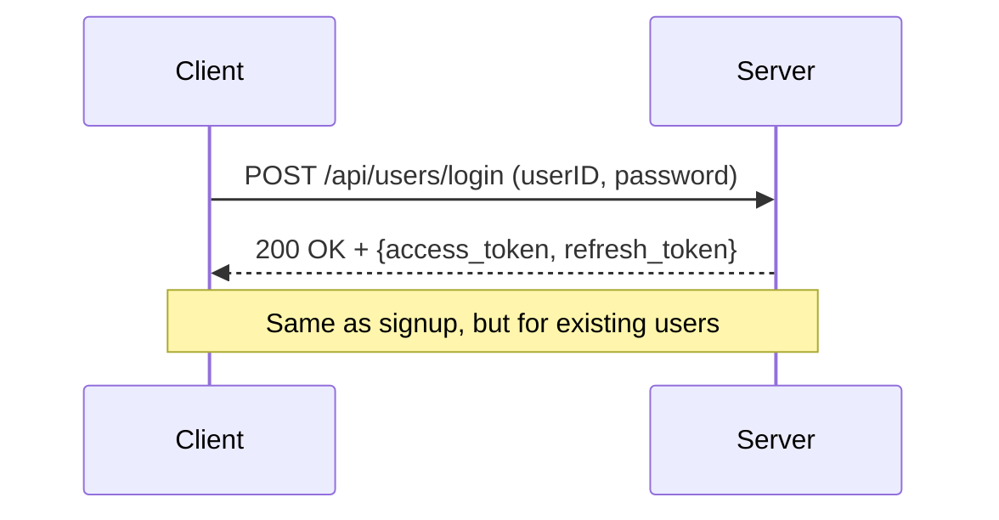
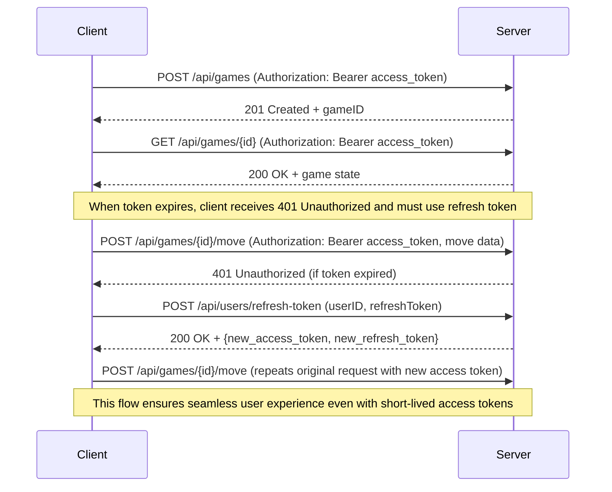

# Multiplayer Tic Tac Toe

A multiplayer Tic Tac Toe game server and client implementation in Go, featuring JWT-based authentication, automatic matchmaking, and a RESTful API.

**Contents:**
- [Quick Start](#quick-start)
    * [Running the server](#running-the-server)
    * [Running the client](#running-the-client)
    * [Running tests](#running-tests)
- [Protocol Design](#protocol-design)
- [Authentication](#authentication)
- [Development](#development)
- [Future Improvements](#future-improvements)

[Task description](./TASK.md)

**Implemented**:
- Registration and login with password hashing
- JWT authentication with access and refresh tokens
- Simple matchmaking and game state management
- CLI client with polling-based updates
- In-memory data storage (users, games)
- Unit, integration and concurrency tests
- REST API with OpenAPI documentation
- Codegeneration for client stubs
- Dockerfile for server
- Makefile with convenient commands

## Quick Start

### Prerequisites

- Go 1.26.2 or higher
- `make` (optional, for convenience commands)

### Installation

Clone the repository and install dependencies:

```bash
git clone <repository-url>
cd tic-tac-toe
make install
```

### Running the Server

Start the server on `localhost:8080`:

```bash
make start-server
```

The server will start and display:
```
Server listening on :8080
```

You can access the Swagger UI documentation at: `http://localhost:8080/swagger/index.html`

### Running Server In Docker
Build
```bash
make build-server-docker
```

Run
```bash
make start-server-docker
```

### Running the Client
**Important!** Client's code is separated from the server's, so it can be run only from `cmd/client` directory.

#### Basic scenario for 2 players
Open **two separate terminals** and run a client in each:

**Terminal 1 (Player 1):**
```bash
make start-client USER=alice PASSWORD=alicepass
```

**Terminal 2 (Player 2):**
```bash
make start-client USER=bob PASSWORD=bobpass
```

The clients will:
1. Automatically register (on first run) or login
2. Create or join a game via matchmaking
3. Take turns making moves
4. Display the game board after each move
5. Show the final result (win/loss/draw)

#### Making moves
Cells are numbered like a phone keypad. Empty cells show their number, so just
type the number of the cell you want:

```
 1 | 2 | 3
---+---+---
 4 | 5 | 6
---+---+---
 7 | 8 | 9
```

- Type a number `1`-`9` on your turn to play that cell.
- Type `q` (or `quit`) at **any** time — including while waiting for the
  opponent — to forfeit and leave.

On an interactive terminal the board is redrawn in place, with the last move and
any winning line highlighted. Under `DEBUG=true` (or when output is piped) the
client prints linearly instead.

#### Password prompt
If you omit `PASSWORD`, the client prompts for it without echoing to the
terminal — safer than passing it on the command line where it lands in shell
history and the process list:

```bash
make start-client USER=alice
# Password: ********
```

### Advanced scenarios
**Join Any Waiting Game or Create a New One**

```bash
make start-client USER=alice PASSWORD=alicepass
```

**Connecting To Specific Game**

```bash
make start-client USER=alice PASSWORD=alicepass ARGS="-game <gameID>"
```

Thorough Client development seems to be an overkill for such a task, so the behavior is simplified:
- If `-game` is provided the client will attempt to join that specific game. If the game does not exist or is already full, it will return an error.
- If `-game` is not provided, the client looks up for the latest game in `waiting` status and joins it. If no such game exists, it creates a new one.
- If client was in the game, on restart it will ignore that game unless `-game` parameter is provided.

**Debug mode**

Add `DEBUG=true` to the command to enable debug logging in the client. HTTP
requests and responses are written to a log file named `<userID>-<timestamp>.log`
in the working directory (these `*.log` files are git-ignored).

```bash
make start-client USER=alice PASSWORD=alicepass DEBUG=true
```

### Running Tests
Tests include:
* unit tests
* integration tests for API endpoints
* concurrency tests

Run all tests with verbose output:

```bash
make tests
```

Run tests with race detection:

```bash
make test-race
```

## Protocol Design

### Overview

The system uses a **REST API over HTTP** with **polling-based state updates**. Clients communicate with the server via HTTP POST/GET requests, and poll the game state periodically to detect changes (opponent moves, game completion, etc.).

### Game Flow



### Authentication Flow

#### Signup


#### Login


#### Using Access Token


### API Endpoints
**Run server** and open [OpenAPI docs](http://localhost:8080/swagger/index.html) for detailed endpoint information.

### Polling Mechanism

Clients use a **polling strategy** to monitor game state changes:

- **Wait for opponent:** Poll every 1 second until `status` changes from `"waiting"` to `"in_progress"`
- **Wait for turn:** Poll every 1 second until `currentPlayerID` matches your user ID
- **Check game end:** Poll every 1 second until `status` becomes `"finished"`

This approach is simple and stateless but introduces latency (up to 1 second for updates). Future improvements could include WebSockets or Server-Sent Events for real-time updates.

### Error Handling

All errors return HTTP status codes with a JSON body:

```json
{
  "error": "error message description"
}
```

Common status codes:
- `400 Bad Request` - Invalid input, occupied cell, out-of-turn move, etc.
- `401 Unauthorized` - Missing or invalid authentication token
- `404 Not Found` - Game or user not found
- `409 Conflict` - User already exists (signup)
- `500 Internal Server Error` - Unexpected server error


## Authentication

### Mechanism: JWT (JSON Web Tokens)

The server uses **JWT tokens** for stateless authentication. This design choice offers several advantages:

**Why JWT?**
- ✅ **Stateless:** No server-side session storage required (scales horizontally)
- ✅ **Standard:** Well-established, widely supported protocol
- ✅ **Self-contained:** Tokens carry user identity (claims), reducing database lookups
- ✅ **Secure:** HMAC-SHA256 signature prevents tampering
- ✅ **Expiration:** Built-in time-based validity

**Tradeoffs:**
- ❌ Cannot revoke tokens before expiration (mitigation: short-lived access tokens + refresh tokens stored in the database). Revocation could be implemented with in-memory whitelist for fast checkup and key-value store (e.g. Redis) for persistence.
- ❌ Token size larger than session IDs (acceptable overhead for HTTP headers and avoids server-side storage)
- ❌ Asymmetric JWT signing (e.g. RSA) would be more secure but adds complexity; HMAC is sufficient for this use case

### Token Lifecycle

The system uses a **dual-token approach**:

1. **Access Token**
   - Lifetime: **10 seconds**
   - Used for authenticating game API requests
   - Short-lived to minimize risk if leaked
   - Claims: `user_id`, `exp`, `iat`, `nbf`, `iss`

2. **Refresh Token**
   - Lifetime: **7 days**
   - Used to obtain new access tokens without re-login
   - Stored hashed on server side for security
   - Cannot be used for game operations

### Security Considerations

- **Password storage:** Passwords are hashed using **bcrypt** (cost factor 10) before storage
- **Minimum password length:** 6 characters
- **Token signing:** HMAC-SHA256 with a secret key (configurable)
- **Refresh token storage:** Refresh tokens are hashed (SHA256) before storage to prevent misuse if database is compromised
- **Token validation:** Every protected endpoint validates the Bearer token signature, expiration, and issuer

## Development

### Hot Reload (Server)

Use `air` for automatic server reloads during development:

```bash
make serve
```

### Regenerate OpenAPI Client

If you modify the API endpoints:

```bash
# Update Swagger docs
make swag-init

# Regenerate client stubs
make codegen-client
```

## Future Improvements

Additionally to bonus features mentioned in the [task](./TASK.md), here are some future improvements:
* If `-game` parameter is not passed to client, it looks up for the last played unfinished game and joins it instead of creating a new one. This allows for easier testing and quicker game start without needing to copy-paste game IDs.
* Store in memory the last timestamp when user *touched* the game and provide this info to the opponent. It allows to detect if opponent is AFK and maybe implement some timeout-based game end in the future.
* Matchmaking consurrency-safe without locks, either use SQL database `SELECT FOR UPDATE` or implement in-memory queue of waiting games with atomic operations or channels.
* Pass context to services and repository when real database is used to allow for better cancellation and timeouts.